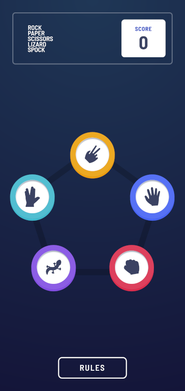

# Frontend Mentor - Rock, Paper, Scissors (w/ bonus) solution

This is a solution to the [Rock, Paper, Scissors challenge (w/ bonus) on Frontend Mentor](https://www.frontendmentor.io/challenges/rock-paper-scissors-game-pTgwgvgH).

## Table of contents

- [Overview](#overview)
  - [The challenge](#the-challenge)
  - [Screenshot](#screenshot)
  - [Links](#links)
- [My process](#my-process)
  - [Built with](#built-with)
  - [What I learned](#what-i-learned)
- [Author](#author)

## Overview

### The challenge

Users should be able to:

- View the optimal layout for the game depending on their device's screen size
- Play Rock, Paper, Scissors against the computer
- Maintain the state of the score after refreshing the browser _(optional)_
- **Bonus**: Play Rock, Paper, Scissors, Lizard, Spock against the computer _(optional)_

### Screenshot




### Links

- Solution URL: [Go to solution](https://www.frontendmentor.io/solutions/rock-paper-scissors-lizard-spock-sveltekit-tailwind-typescript-H9YeK1xThg)
- Live Site URL: [Go to live site](https://rock-paper-scissors-lizard-spock-one.vercel.app/)

## My process

### Built with

- Semantic HTML5 markup
- Flexbox
- CSS Grid
- Mobile-first workflow
- [LocalStorage](https://developer.mozilla.org/fr/docs/Web/API/Window/localStorage) - Save data on the browser
- [SvelteKit](https://kit.svelte.dev/) - JS framework w/ SSR (Server-Side Rendering)
- [TailwindCss](https://tailwindcss.com/) - Utility-first CSS framework
- [Typescript](https://www.typescriptlang.org/) - Strongly typed JS

### What I learned

#### Delay function execution

Little helper function to delay the display of the hand choice:

```ts
const later = (delay: number = 1000) => {
  return new Promise((resolve) => setTimeout(resolve, delay));
};
```

Used in the process like this:

```ts
export const startGame = async (player: GameChoice) => {
  const hand = getRandomChoice(); // Get hand choice
  const result = getResult({ player, hand }); // Get result
  // Start game & Register player move
  gameboard.update((prev) => ({ ...prev, status: "playing", choices: { ...prev.choices, player } }));
  // Show random hand move & results after delay
  await later(4000);
  gameboard.update((prev) => {
    const score = getNewScore(prev.score, result);
    return { ...prev, choices: { ...prev.choices, hand }, result, score };
  });
};
```

#### Radial gradient

Used twice in the app for the winner "halo" and the body background:

body background:

```js
plugin(({ addUtilities, theme }) => {
  addUtilities({
    ".bg-gradient": {
      background: `radial-gradient(circle at top, ${theme("colors.gradient.light")} 0, ${theme("colors.gradient.dark")} 100%)`,
    },
    // Other custom classes
  });
}),
```

winning halo:

```css
.halo-radial {
  background: radial-gradient(
    circle,
    rgba(39, 50, 82, 0.95) 0 40%,
    rgba(39, 50, 82, 0.7) 40% 55%,
    rgba(33, 44, 76, 0.7) 55% 80%,
    rgba(38, 58, 89, 0.7) 80% 100%
  );
}
```

## Author

- Frontend Mentor - [@AntoineC-dev](https://www.frontendmentor.io/profile/AntoineC-dev)
